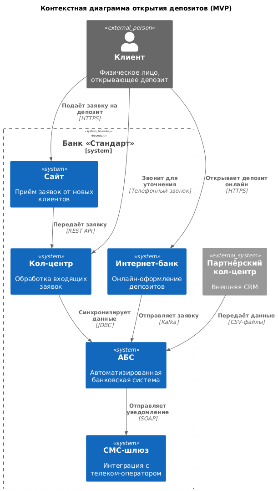
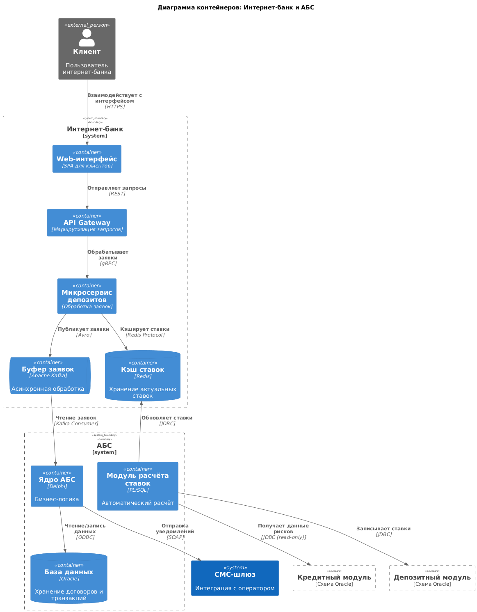

### **Название задачи:**  
Концептуальная архитектура MVP для открытия депозитов в банке «Стандарт»

### **Автор:**  
Никонова Василиса

### **Дата:**  
22.05.2025

---

### **Функциональные требования**

| **№** | **Действующие лица или системы**       | **Use Case**                                                                 | **Описание**                                                                                                                                 |
|-------|-----------------------------------------|------------------------------------------------------------------------------|---------------------------------------------------------------------------------------------------------------------------------------------|
| 1     | Клиент                                  | Подача заявки на депозит через сайт                                          | Клиент заполняет форму на сайте (Ф.И.О., телефон). Заявка передаётся в кол-центр.                                                          |
| 2     | Клиент                                  | Подача заявки на депозит через интернет-банк                                 | Клиент выбирает депозит, указывает счёт и сумму. Подтверждает операцию СМС-кодом. Заявка поступает в АБС через промежуточный слой (Kafka). |
| 3     | Оператор кол-центра                    | Обработка заявки с сайта                                                     | Оператор видит заявку в системе кол-центра, связывается с клиентом, уточняет детали.                                                        |
| 4     | Сотрудник фронт-офиса                  | Идентификация клиента в отделении                                            | Новый клиент приходит в отделение для подтверждения личности. Данные вносятся в АБС.                                                       |
| 5     | Сотрудник бэк-офиса                    | Подтверждение условий депозита                                               | Бэк-офис проверяет заявку из интернет-банка, подтверждает ставку в АБС.                                                                    |
| 6     | АБС                                    | Автоматический расчёт ставок                                                 | АБС рассчитывает ставки на основе данных кредитного риска и передаёт их в интернет-банк.                                                   |

---

### **Нефункциональные требования**

| **№** | **Требование**                                                                 |
|-------|--------------------------------------------------------------------------------|
| 1     | Доступность интернет-банка — 99.9%.                                           |
| 2     | Время отклика операций < 1 сек.                                               |
| 3     | Шифрование данных при передаче (TLS 1.3, AES-256).                            |
| 4     | Горизонтальное масштабирование интернет-банка.                                |
| 5     | Изоляция данных кредитного и депозитного отделов в АБС.                       |
| 6     | Резервное копирование данных между ЦОДами в режиме реального времени.         |

---

### **Решение**

#### **Диаграмма контекста (C4 Level 1)**  
  
*Описание:*  
- **Клиенты** взаимодействуют с сайтом и интернет-банком.  
- **Кол-центр** обрабатывает заявки через свою систему.  
- **АБС** — центральная система для обработки депозитов.  
- **СМС-шлюз** отправляет уведомления клиентам.  

#### **Диаграмма контейнеров (C4 Level 2)**  
  
*Описание:*  
- **Интернет-банк**:  
  - Модуль депозитов.  
  - Кэш ставок.  
  - API-шлюз для интеграции с Kafka.  
- **АБС**:  
  - Модуль расчёта ставок.  
  - Модуль договоров.  
  - База Oracle с раздельными схемами для кредитов и депозитов.  

#### **Ключевые решения:**  
1. **Использование Kafka** для асинхронной обработки заявок:  
   - Снижает нагрузку на АБС.  
   - Обеспечивает отказоустойчивость.  
2. **Микросервисная архитектура модуля депозитов**:  
   - Позволяет масштабировать интернет-банк горизонтально.  
   - Изолирует риски от основного монолита.  
3. **Ролевая модель доступа в АБС**:  
   - Кредитный и депозитный отделы работают в отдельных схемах.  
   - Данные передаются через API с контролем доступа.  

---

### **Альтернативы**

#### **Альтернатива 1: Прямая интеграция интернет-банка с АБС**  
- **Преимущества**: Упрощение архитектуры.  
- **Недостатки**: Риск перегрузки АБС, нарушение SLA 99.9%.  

#### **Альтернатива 2: Использование RabbitMQ вместо Kafka**  
- **Преимущества**: Проще внедрить в текущий стек.  
- **Недостатки**: Ограниченная поддержка масштабирования.  

#### **Недостатки и риски выбранного решения:**  
1. **Сложность внедрения Kafka**:  
   - Требует обучения команды.  
   - Несовместимость с текущей версией интернет-банка.  
2. **Вертикальное масштабирование АБС**:  
   - Ограничивает рост нагрузки.  
3. **Зависимость от Oracle**:  
   - Миграция на другую СУБД потребует значительных ресурсов.  
