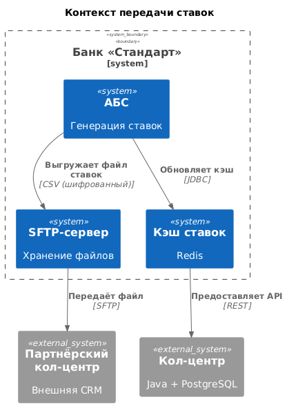
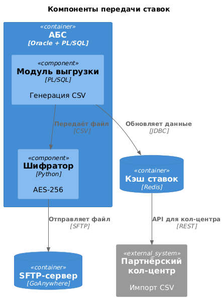
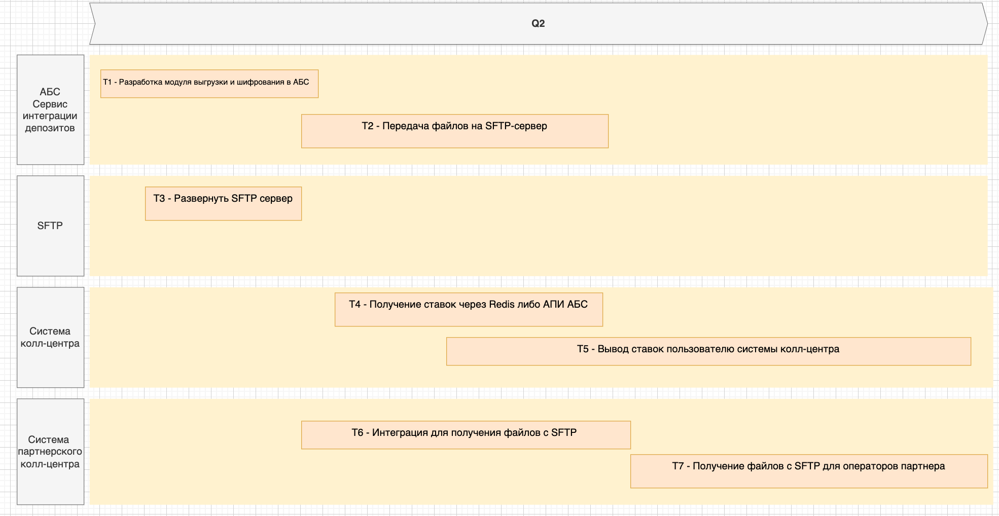

### **Название задачи:**  
Интеграция передачи актуальных ставок в кол-центр и партнёрский кол-центр

### **Автор:**  
Никонова Василиса

### **Дата:**  
22.05.2025

---

### **Функциональные требования**

| **№** | **Действующие лица или системы** | **Use Case**                                                                 | **Описание**                                                                 |
|-------|-----------------------------------|------------------------------------------------------------------------------|-----------------------------------------------------------------------------|
| 1     | АБС                              | Ежедневная выгрузка актуальных ставок в файл                                 | АБС генерирует CSV-файл с текущими ставками каждый день в 08:00.            |
| 2     | SFTP-сервер                      | Передача файла ставок партнёрскому кол-центру                               | Файл шифруется (AES-256) и отправляется через SFTP.                         |
| 3     | Кол-центр                        | Получение актуальных ставок через API                                       | Система кол-центра запрашивает ставки через REST API из кэша Redis.         |
| 4     | Партнёрский кол-центр            | Импорт ставок из файла                                                     | Операторы загружают файл в свою CRM-систему.                                |

---

### **Нефункциональные требования**

| **№** | **Требование**                                                                 |
|-------|--------------------------------------------------------------------------------|
| 1     | Шифрование файлов ставок (AES-256) и передача по SFTP.                        |
| 2     | Гарантированная доставка файлов партнёрскому кол-центру (повторные попытки).  |
| 3     | Задержка обновления ставок в кол-центре ≤ 5 минут.                            |
| 4     | Совместимость формата файла с внешней CRM партнёра (CSV UTF-8).               |

---

### **Решение**

#### **Диаграмма контекста (C4 Level 1)**  
  
*Описание:*  
- **АБС** выгружает ставки в файл и отправляет его на SFTP-сервер.  
- **Кол-центр** получает ставки через API из Redis.  
- **Партнёрский кол-центр** забирает файл через SFTP.  

#### **Диаграмма компонентов (C4 Level 3)**  
  
*Описание:*  
- **АБС**:  
  - **Модуль выгрузки ставок** (PL/SQL) — генерирует CSV-файл.  
  - **Шифратор** (Python) — шифрует файл перед отправкой.  
- **SFTP-сервер** (GoAnywhere) — хранит файлы 24 часа.  
- **Redis** — кэш актуальных ставок для кол-центра.  

#### **Ключевые решения:**  
1. **Выгрузка файлов через SFTP** вместо API:  
   - Партнёрский кол-центр не поддерживает API.  
   - SFTP обеспечивает безопасную передачу.  
2. **Кэширование ставок в Redis**:  
   - Кол-центр получает данные в реальном времени без нагрузки на АБС.  

---

### **Альтернативы**

#### **Альтернатива 1: Прямой доступ партнёра к АБС**  
- **Преимущества**: Актуальные данные в реальном времени.  
- **Недостатки**: Нарушение политики безопасности банка.  

#### **Альтернатива 2: Использование облачного хранилища (S3)**  
- **Преимущества**: Упрощение логистики файлов.  
- **Недостатки**: Дополнительные затраты на облако.  

#### **Недостатки и риски выбранного решения:**  
1. **Задержка обновления файлов**: До 24 часов для партнёра.  
2. **Ручной импорт файла**: Риск ошибок при загрузке в CRM партнёра.  

---

### **Список задач для систем**
| **Система**          | **Задачи**                                                                 |
|-----------------------|----------------------------------------------------------------------------|
| АБС                  | 1. Разработка модуля выгрузки ставок. 2. Интеграция шифрования файлов. |
| SFTP-сервер          | 1. Настройка автоматической очистки файлов старше 24 часов.               |
| Кол-центр            | 1. Интеграция с API Redis. 2. Обновление интерфейса операторов.        |
| Партнёрский кол-центр| 1. Настройка автоматического импорта CSV-файлов.                          |

---

### **RoadMap в draw.io**  
  

